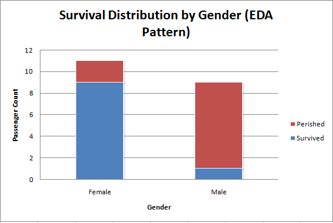
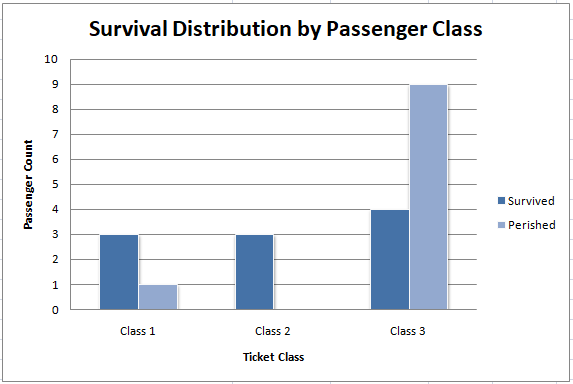

# PRODIGY_DS_02
TASK 2 IN DATA SCIENCE(PRODIGY INFOTECH)
# Prodigy InfoTech Data Science Internship - Task 2

## Project Overview
This repository contains the completion of **Task 2** for the Prodigy InfoTech Data Science Internship. The objective of this project is to perform data cleaning and Exploratory Data Analysis (EDA) on the classic **Titanic Dataset** to explore relationships between variables, handle missing data, and identify key patterns and trends surrounding passenger survival rates.

The entire workflow, analysis, and visualization dashboard have been built using **Microsoft Excel**.

---

## Dataset & Files Included
* **`Prodigy_Task_2.xlsx`**: The complete Excel workbook containing both the raw/cleaned data sheet and the interactive analytics dashboard.
* **`Cleaned Titanic Data` Tab**: Features the processed dataset with missing values handled, numerical formatting optimized, and age demographics categorized.
* **`EDA Dashboard` Tab**: Contains summary cards (KPIs), statistical contingency tables, and embedded data visualizations.

---

## Data Cleaning Workflow
Before analyzing trends, the raw dataset was cleaned and structured within Excel using the following data processing techniques:
1. **Handling Missing Values (Imputation):**
   * **Age**: Missing records were imputed using the median age of the population (`28.0`) to preserve the distribution without creating statistical bias.
   * **Embarked**: Blank fields were filled with the mode value (`Southampton`), representing the most frequent port of origin.
2. **Feature Engineering / Data Binning:**
   * An `Age Group` column was created using conditional `=IF()` logic to categorize continuous age values into meaningful blocks (`0-17`, `18-35`, `36-55`, `56+`) for easier categorical trend analysis.
3. **Data Formatting:**
   * Converted variables to proper typography, standardized text values, and applied explicit monetary styling (`$#,##0.00`) to the `Fare` attribute.

---

## Exploratory Data Analysis (EDA) Insights

### 1. Demographic Trend: Survival by Gender
* **Insight:** A strong correlation exists between passenger gender and survival rates. Female passengers experienced a significantly higher probability of survival, aligning with historical "women and children first" evacuation protocols.
* **Excel Visualization:** Cross-variable frequency counts were calculated using `=COUNTIFS()` and plotted using a **Stacked Column Chart**.

### 2. Socio-Economic Trend: Survival by Ticket Class (Pclass)
* **Insight:** There is a clear pattern indicating that socioeconomic standing heavily influenced a passenger's chances of survival. Passengers holding 1st Class tickets had a vastly higher survival frequency compared to those in 3rd Class.
* **Excel Visualization:** Generated using a summary distribution grid feeding a **Clustered Column Chart**.

---

## Visualizations

---

## Technologies Used
* **Software:** Microsoft Excel (Advanced formulas: `COUNTIFS`, `COUNTA`, `AVERAGE`)
* **Visualization Engine:** Excel Native Charts (Stacked Column, Clustered Column)
* **Version Control:** Git / GitHub
